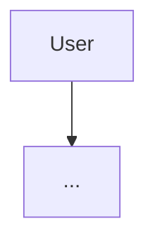

# Phase 16: Documentation - Research

**Researched:** 2026-03-03
**Domain:** Open source technical documentation for a self-hosted Python/FastAPI/Docker project
**Confidence:** HIGH

---

## Summary

Phase 16 creates the complete open source documentation for Roost — a self-hosted vacation rental operations platform. The deliverables are: README.md, CONTRIBUTING.md, an architecture doc, an API reference, a deployment guide, and CHANGELOG.md.

Research covered three areas: (1) codebase archaeology — reading every significant file to produce accurate content, (2) documentation conventions — keepachangelog format, Mermaid on GitHub, shields.io badges, and README patterns from Fastify/Caddy, and (3) documentation structure best practices for self-hosted open source projects.

The codebase is fully understood. The documentation can be written accurately from first principles — no reverse-engineering needed. Every endpoint, model, config field, startup sequence, and data flow is documented inline in the source. The primary planning challenge is organizing this material into the right deliverable format, not discovering what exists.

**Primary recommendation:** Write docs from the codebase directly. The source code comments and docstrings are the ground truth — do not paraphrase from memory, reference the actual files.

---

## Standard Stack

This phase produces Markdown files, not code. No new libraries are installed.

### Tools in Use (no installation required)

| Tool | Version | Purpose | Notes |
|------|---------|---------|-------|
| Mermaid | GitHub-native | Architecture diagrams in Markdown | Rendered automatically by GitHub in fenced `mermaid` blocks |
| shields.io | API service | README badges | No installation — URL-based SVG badges |
| keepachangelog.com | v1.1.0 spec | CHANGELOG format | Convention only, no tooling |
| FastAPI /docs | Built-in | OpenAPI Swagger UI | Served at http://localhost:8000/docs when running |
| FastAPI /redoc | Built-in | ReDoc API docs | Served at http://localhost:8000/redoc when running |

### Alternatives Considered

| Instead of | Could Use | Tradeoff |
|------------|-----------|----------|
| Mermaid inline | Draw.io / Lucidchart images | Mermaid renders natively on GitHub; images require external hosting and don't diff well |
| shields.io | custom badges | shields.io is the ecosystem standard; no reason to deviate |
| Manual keepachangelog | git-cliff or auto-changelog | Tooling adds complexity; manual is fine for v1.0 single entry |

---

## Architecture Patterns

### Recommended File Structure

```
roost/                        # repo root
├── README.md                 # Project overview, features, quick start, badges
├── CONTRIBUTING.md           # Dev environment, code style, PR process
├── CHANGELOG.md              # keepachangelog v1.1.0 format
├── docs/
│   ├── architecture.md       # System design, components, data flow, Mermaid diagrams
│   ├── api.md                # Curated API guide — workflow-oriented with curl examples
│   └── deployment.md         # Step-by-step Docker self-hosting guide
```

This matches the user decision: README/CONTRIBUTING/CHANGELOG at root, architecture/API/deployment in `docs/`.

### README Structure (user-decided: Fastify/Caddy style)

Per CONTEXT.md decisions, the README follows: description → features → quick start.

```
# Roost

[one-line tagline]

[badges row]

[2-3 sentence description]

## Features
- bullet list

## Screenshots
[key dashboard views]

## Quick Start
[copy-paste commands]

## Configuration
[table of config files]

## CLI
[manage.py commands]

## License
```

**Design rationale from reference projects:**
- Fastify: professional badge row, core features list before code examples, benchmarks to establish credibility
- Caddy: centered logo, clear tagline above the fold, "Every site on HTTPS" — one sentence conveys the value

### Badge Selection (Claude's discretion per CONTEXT.md)

Recommended badges for Roost based on what the project actually has and what reads as credible for a self-hosted tool:

| Badge | URL pattern | Value |
|-------|-------------|-------|
| License: Apache 2.0 | `https://img.shields.io/github/license/{owner}/{repo}` | Shows open source intent |
| Python 3.12+ | `https://img.shields.io/badge/python-3.12%2B-blue` | Signals version requirement |
| Docker | `https://img.shields.io/badge/docker-compose-ready-blue?logo=docker` | Primary deployment target |
| FastAPI | `https://img.shields.io/badge/FastAPI-0.115%2B-009688?logo=fastapi` | Tech stack signal |

**Recommended against:**
- Build status badges (no CI/CD configured yet — would show failing or absent)
- Coverage badges (no coverage tooling configured)
- Version/PyPI badges (not published to PyPI)

Keep to 4 badges max. Clean signal over badge collection.

### Mermaid Diagrams

GitHub renders Mermaid natively in `.md` files using fenced code blocks:

```

```

**Diagram types to use for architecture doc:**

1. **System component diagram** — `graph LR` or `graph TD` flowchart showing the major subsystems: ingestion, accounting, compliance, communication, query, frontend
2. **Automation pipeline sequence** — `sequenceDiagram` showing the end-to-end flow: CSV upload → booking inserted → background tasks (resort submission, revenue recognition, welcome message)
3. **ERD (Entity Relationship Diagram)** — `erDiagram` showing the 12 database tables and their relationships
4. **Startup sequence** — `sequenceDiagram` or `graph TD` for the 6-step lifespan startup

**ERD entities to include (from models/):**
- properties
- bookings
- import_runs
- bank_transactions
- accounts
- journal_entries
- journal_lines
- expenses
- loans
- reconciliation_matches
- resort_submissions
- communication_logs

### API Documentation Structure (user-decided: workflow-oriented)

The hand-written `docs/api.md` is organized by workflow, not by resource. With curl examples for key workflows only.

**Workflows warranting curl examples (Claude's discretion):**

| Workflow | Why it needs curl | Complexity |
|----------|-------------------|------------|
| Upload Airbnb CSV | Primary data entry — file upload pattern is non-obvious | Medium |
| Process a new booking end-to-end | Shows the background task chain | High |
| Generate a P&L report | Period parameter options are non-trivial | Medium |
| Query in natural language | SSE streaming response requires special client handling | High |
| Record a loan payment | Multi-field payload, idempotency key | Medium |

**Minor endpoints that get descriptions only (no curl):**
- GET /health
- GET /ingestion/bookings, /ingestion/history, /ingestion/bank-transactions
- GET /api/dashboard/*
- GET /api/accounting/balances, /api/accounting/expenses, /api/accounting/loans
- GET /api/compliance/submissions
- GET /api/communication/logs
- POST /api/compliance/confirm, /api/compliance/approve, /api/communication/confirm

### CHANGELOG Format (keepachangelog v1.1.0)

```markdown
# Changelog

All notable changes to this project will be documented in this file.

The format is based on [Keep a Changelog](https://keepachangelog.com/en/1.1.0/),
and this project adheres to [Semantic Versioning](https://semver.org/spec/v2.0.0.html).

## [Unreleased]

## [1.0.0] - 2026-03-03

### Added
- [feature bullet list]

[1.0.0]: https://github.com/{owner}/{repo}/releases/tag/v1.0.0
[Unreleased]: https://github.com/{owner}/{repo}/compare/v1.0.0...HEAD
```

Categories defined by keepachangelog spec: Added, Changed, Deprecated, Removed, Fixed, Security.

For v1.0 release entry, use only **Added** (it's all new). List the major capabilities.

---

## Don't Hand-Roll

| Problem | Don't Build | Use Instead | Why |
|---------|-------------|-------------|-----|
| API reference | Manual endpoint list | Link to FastAPI's `/docs` (Swagger UI) and `/redoc` for full spec | FastAPI auto-generates from type hints and docstrings; it's always current |
| Badge SVGs | Custom SVG files | shields.io URL-based badges | Standard, maintained, no maintenance burden |
| Architecture diagrams as images | PNG/SVG exports | Mermaid inline code blocks | GitHub-native rendering, version-controllable, diffable |
| Changelog generation | Custom scripts | Manual keepachangelog | Single v1.0 entry doesn't need tooling |

**Key insight:** FastAPI's built-in `/docs` and `/redoc` are genuinely better than a hand-rolled endpoint table. The API doc (`docs/api.md`) should link to these for the full spec and focus on workflow narrative and curl examples that the auto-generated docs don't provide.

---

## Common Pitfalls

### Pitfall 1: Documenting the wrong URLs
**What goes wrong:** Deployment guide shows `localhost:8000` in examples that should show the user's actual server address.
**Why it happens:** Easy to copy-paste from dev testing.
**How to avoid:** Distinguish clearly between localhost (verification step) and production setup. Use `<YOUR_SERVER_IP>` placeholder.
**Warning signs:** Review guide for any hardcoded `localhost` in "after deployment" sections.

### Pitfall 2: Config file documentation drift
**What goes wrong:** Config docs describe fields that don't match `app/config.py` or `config/base.example.yaml`.
**Why it happens:** Config is the ground truth; docs written from memory drift.
**How to avoid:** Copy the field list directly from `AppConfig` and `PropertyConfig` in `app/config.py`. Every field is documented inline there.
**Warning signs:** Any config field in docs not present in `AppConfig` or `PropertyConfig` classes.

### Pitfall 3: Automation pipeline described incorrectly
**What goes wrong:** Architecture doc claims revenue recognition or resort submission happen at import time; they're actually background tasks fired after upload response.
**Why it happens:** It's counterintuitive — the endpoint returns before background tasks complete.
**How to avoid:** Re-read `app/api/ingestion.py` — the `BackgroundTasks.add_task()` calls are after the response is assembled. Revenue recognition fires automatically on import (as background task); manual `recognize-all` is a separate operator-triggered path.
**Warning signs:** Any claim that "the API returns after all processing is complete."

### Pitfall 4: VRBO/RVshare vs Airbnb messaging described incorrectly
**What goes wrong:** Doc says Roost sends guest messages directly for all platforms.
**Why it happens:** The communication module exists and sounds like a direct sender.
**How to avoid:** Re-read `app/communication/messenger.py` and `CommunicationLog` status values. For Airbnb, status is `native_configured` — Airbnb sends natively, Roost only notifies the operator. For VRBO/RVshare, Roost generates the message and notifies the operator to send it manually, then operator confirms via API.
**Warning signs:** Any phrase like "Roost sends messages to guests."

### Pitfall 5: Missing SMTP configuration in deployment guide
**What goes wrong:** User follows the guide and resort form submissions silently fail because SMTP wasn't configured.
**Why it happens:** SMTP fields (smtp_host, smtp_port, smtp_user, smtp_password, smtp_from_email) look optional in `AppConfig` (they have defaults).
**How to avoid:** Deployment guide must treat SMTP as required for compliance/communication features. Include all 5 SMTP fields in the `.env` setup section.
**Warning signs:** Any deployment guide that lists only DATABASE_URL and POSTGRES_PASSWORD in .env setup.

### Pitfall 6: Ollama presented as required
**What goes wrong:** Users think they can't use Roost without Ollama.
**Why it happens:** It's listed in prerequisites and setup steps.
**How to avoid:** Clearly state Ollama is optional — natural language query is degraded-gracefully if unavailable. Health endpoint reports `"ollama": "unavailable"` but status remains `"ok"`.
**Warning signs:** Ollama listed under "Required Prerequisites" without the optional qualifier.

### Pitfall 7: Screenshot selection wrong views
**What goes wrong:** Screenshots show empty/seeded-data states that look unconvincing.
**Why it happens:** Screenshots taken before real booking data loaded.
**How to avoid:** Note in planning that screenshots are placeholders — actual screenshots should show populated data. The three views specified in CONTEXT.md are: dashboard (HomeTab with stat cards and occupancy chart), booking detail, and accounting. Defer actual screenshot capture to task execution.

---

## Code Examples

Verified patterns from source code (for use in docs):

### Health check endpoint
```bash
# Source: app/api/health.py
curl http://localhost:8000/health
```

Response shape:
```json
{
  "status": "ok",
  "timestamp": "2026-03-03T12:00:00+00:00",
  "version": "0.1.0",
  "properties": [
    {"slug": "my-cabin", "display_name": "My Cabin"}
  ],
  "database": "connected",
  "ollama": "available"
}
```

### Upload Airbnb CSV
```bash
# Source: app/api/ingestion.py — POST /ingestion/airbnb/upload
curl -X POST http://localhost:8000/ingestion/airbnb/upload \
  -F "file=@airbnb_transactions.csv"
```

### Generate P&L Report
```bash
# Source: app/api/reports.py — GET /api/reports/pl
curl "http://localhost:8000/api/reports/pl?ytd=true"
curl "http://localhost:8000/api/reports/pl?year=2026"
curl "http://localhost:8000/api/reports/pl?month=1&year=2026"
curl "http://localhost:8000/api/reports/pl?quarter=Q1&year=2026"
```

### Natural Language Query (SSE stream)
```bash
# Source: app/api/query.py — POST /api/query/ask
# SSE response — use curl --no-buffer or EventSource in browser
curl -X POST http://localhost:8000/api/query/ask \
  -H "Content-Type: application/json" \
  -d '{"message": "What was my total revenue last month?"}' \
  --no-buffer
```

SSE events emitted: `sql`, `results`, `token` (repeated), `done` (or `error`).

### Record Loan Payment
```bash
# Source: app/api/accounting.py — POST /api/accounting/loans/payments
curl -X POST http://localhost:8000/api/accounting/loans/payments \
  -H "Content-Type: application/json" \
  -d '{
    "loan_id": 1,
    "principal": "500.00",
    "interest": "125.00",
    "payment_date": "2026-03-01",
    "payment_ref": "2026-03"
  }'
```

### Startup Sequence (for architecture doc)
Source: `app/main.py` lifespan context:
1. Load and validate config — FAIL-FAST (SystemExit on any invalid config)
2. Validate Jinja2 templates — FAIL-FAST (catches variable typos)
3. Verify database connection — FAIL-FAST
3b. Sync properties from YAML → database (upsert)
4. Check Ollama connectivity — NON-FATAL (LLM features disabled if unavailable)
5. Start APScheduler — compliance urgency check runs daily at 08:00
6. Rebuild pre-arrival message scheduler jobs from database

---

## Codebase Inventory (for accurate documentation)

Verified from source. Use this when writing docs.

### API Endpoints (complete list)

**Health**
- `GET /health` — DB + Ollama + config status

**Ingestion** (`/ingestion/`)
- `POST /ingestion/airbnb/upload` — Airbnb Transaction History CSV
- `POST /ingestion/vrbo/upload` — VRBO Payments Report CSV
- `POST /ingestion/mercury/upload` — Mercury bank statement CSV
- `POST /ingestion/rvshare/entry` — RVshare manual booking entry (JSON)
- `GET /ingestion/history` — import run history
- `GET /ingestion/bookings` — unified booking list
- `GET /ingestion/bank-transactions` — bank transactions list

**Accounting** (`/api/accounting/`)
- `GET /api/accounting/journal-entries` — list with filters
- `GET /api/accounting/journal-entries/{id}` — single entry with lines
- `GET /api/accounting/balances` — account balances by type
- `POST /api/accounting/revenue/recognize` — single booking recognition
- `POST /api/accounting/revenue/recognize-all` — batch recognition
- `POST /api/accounting/expenses` — record expense
- `POST /api/accounting/expenses/import` — CSV bulk import
- `GET /api/accounting/expenses` — list expenses
- `POST /api/accounting/loans` — create loan
- `POST /api/accounting/loans/payments` — record loan payment
- `GET /api/accounting/loans` — list loans with balances
- `GET /api/accounting/finance-summary` — badge counts
- `POST /api/accounting/reconciliation/run` — trigger reconciliation
- `GET /api/accounting/reconciliation/unreconciled` — unreconciled queue
- `POST /api/accounting/reconciliation/confirm` — confirm match
- `POST /api/accounting/reconciliation/reject/{match_id}` — reject match
- `GET /api/accounting/bank-transactions` — list with filters
- `PATCH /api/accounting/bank-transactions/categorize` — bulk categorize
- `PATCH /api/accounting/bank-transactions/{id}/category` — single categorize

**Reports** (`/api/reports/`)
- `GET /api/reports/pl` — Profit & Loss (period params: ytd, year, quarter, month, date range)
- `GET /api/reports/balance-sheet` — Balance sheet as of date
- `GET /api/reports/income-statement` — Income statement (period + breakdown params)

**Compliance** (`/api/compliance/`)
- `GET /api/compliance/submissions` — list with status/urgency filters
- `POST /api/compliance/submit/{booking_id}` — trigger single submission
- `POST /api/compliance/confirm/{booking_id}` — mark confirmed (n8n webhook)
- `POST /api/compliance/approve/{submission_id}` — approve preview-mode submission
- `POST /api/compliance/process-pending` — batch-process pending

**Communication** (`/api/communication/`)
- `GET /api/communication/logs` — list with status/type/platform filters
- `POST /api/communication/confirm/{log_id}` — mark message sent

**Dashboard** (`/api/dashboard/`)
- `GET /api/dashboard/properties` — all properties (id, slug, display_name)
- `GET /api/dashboard/metrics` — YTD revenue, expenses, profit, YoY comparison
- `GET /api/dashboard/bookings` — bookings for calendar view
- `GET /api/dashboard/occupancy` — per-property 12-month occupancy rates
- `GET /api/dashboard/actions` — pending resort forms, messages, unreconciled

**Query** (`/api/query/`)
- `POST /api/query/ask` — SSE streaming natural language query pipeline

### Data Models (complete list from models/)
- `properties` — id, slug, display_name
- `bookings` — platform, platform_booking_id, property_id, guest_name, check_in_date, check_out_date, net_amount, reconciliation_status, raw_platform_data
- `import_runs` — platform, filename, inserted_count, updated_count, skipped_count, imported_at
- `bank_transactions` — transaction_id, date, description, amount, reconciliation_status, category, journal_entry_id
- `accounts` — number, name, account_type (asset/liability/equity/revenue/expense), is_active
- `journal_entries` — entry_date, description, source_type, source_id (idempotency key), property_id
- `journal_lines` — entry_id, account_id, amount (positive=debit, negative=credit), description
- `expenses` — expense_date, amount, category, description, attribution, property_id, vendor, journal_entry_id
- `loans` — name, account_id, original_balance, interest_rate, start_date, property_id
- `reconciliation_matches` — booking_id, bank_transaction_id, status (matched/confirmed/rejected)
- `resort_submissions` — booking_id, status (pending/submitted/confirmed), is_urgent, submitted_automatically, confirmation_attached, email_sent_at, confirmed_at
- `communication_logs` — booking_id, message_type (welcome/pre_arrival), platform, status (pending/sent/native_configured), scheduled_for, rendered_message, operator_notified_at

### Tech Stack (from pyproject.toml + Dockerfile)
- **Backend:** Python 3.12, FastAPI, SQLAlchemy 2.0 (ORM + Core), Alembic (migrations), Pydantic Settings (YAML + env config)
- **Database:** PostgreSQL 16 (postgres:16-alpine image)
- **Frontend:** React (Vite, TypeScript) — built into container, served as SPA
- **AI/LLM:** Ollama (local) + any compatible model (default: llama3.2:latest)
- **Email:** aiosmtplib (async SMTP) with tenacity retries
- **PDF:** pypdf (form-filling for resort booking forms)
- **Scheduling:** APScheduler (compliance urgency check + pre-arrival messages)
- **Serialization/ETL:** Polars (CSV parsing), python-slugify, structlog (structured logging)
- **Container:** Docker + Docker Compose (two services: roost-api, roost-db)
- **Package manager:** uv (with uv.lock)
- **License:** Apache 2.0

### Config Files (from config.py + gitignore)
Tracked (example templates only — actual configs gitignored):
- `config/base.example.yaml` — system-wide settings template
- `config/config.example.yaml` — per-property settings template

Not tracked (user secrets):
- `.env` — DATABASE_URL, POSTGRES_*, SMTP_* credentials
- `config/base.yaml` — actual base config (gitignored)
- `config/{slug}.yaml` — actual property configs (gitignored)

### Key Design Decisions (from source + prior STATE.md)
- **Fail-fast startup:** Config, templates, and DB connection all validated before accepting requests
- **Idempotent ingestion:** Bookings and bank transactions use unique constraints; re-importing is safe
- **Background task pattern:** Resort submission, revenue recognition, and welcome messages fire as FastAPI BackgroundTasks after the upload response returns
- **Preview mode:** `auto_submit_threshold` gates automatic resort form submission; below threshold, submissions queue as `pending` for operator approval
- **Airbnb messaging:** Airbnb handles welcome messages natively; Roost logs `native_configured` status and notifies operator
- **VRBO/RVshare messaging:** Roost generates the message, emails the operator, operator sends manually on platform, then calls `/api/communication/confirm/{log_id}`
- **Revenue recognition:** Operator-triggered after booking review (POST /api/accounting/revenue/recognize-all), also fires automatically as background task on import
- **Double-entry accounting:** Chart of accounts seeded in Alembic migration 003; all transactions create balanced journal entries (debit + credit)
- **LLM query pipeline:** Two-phase — Phase A generates SQL (non-streaming, temperature 0.1), Phase B generates narrative (streaming, temperature 0.3); sqlglot validates SQL before execution
- **Package name:** `roost-rental` (not `roost`) — avoids PyPI collision risk

---

## State of the Art

| Old Approach | Current Approach | Notes |
|--------------|------------------|-------|
| Markdown tables for API docs | FastAPI auto-generated Swagger + hand-written workflow guide | FastAPI docs are authoritative; Markdown supplements, not replaces |
| PNG/SVG diagram exports | Mermaid inline code blocks | GitHub has natively rendered Mermaid since 2022 |
| Static keepachangelog | Same — still the standard | No change; format is stable |

---

## Open Questions

1. **Screenshots — actual vs placeholder**
   - What we know: Three views specified (dashboard, booking detail, accounting). Screenshot files don't exist yet.
   - What's unclear: Whether screenshots should be captured during this phase or remain as placeholders.
   - Recommendation: Plan as placeholders with descriptive alt-text during this phase. A separate task can capture real screenshots once a dev instance is running. This keeps Phase 16 unblocked.

2. **GitHub owner/repo for badge URLs**
   - What we know: The repo is `roost` locally. Badge URLs need `{owner}/{repo}` format for shields.io GitHub integration.
   - What's unclear: The actual GitHub organization/username where this will be published.
   - Recommendation: Use placeholder `{owner}/roost` in badge URLs during this phase. Update when the repo is published.

3. **VRBO CSV export format documentation**
   - What we know: The VRBO adapter exists (`app/ingestion/adapters/vrbo.py`). The ingestion doc should tell users where to get the CSV.
   - What's unclear: The exact UI path in VRBO for "Payments Report" export.
   - Recommendation: Document what the planner knows from the adapter (expected headers, "Payments Report" naming) and flag this as needing verification against live VRBO dashboard.

---

## Sources

### Primary (HIGH confidence)
- `app/main.py` — startup sequence, router registration, SPA serving
- `app/config.py` — AppConfig, PropertyConfig, all config fields
- `app/api/*.py` — all 8 API modules, all endpoints with docstrings
- `app/models/*.py` — all 12 database models
- `docker-compose.yml`, `Dockerfile` — deployment configuration
- `pyproject.toml` — dependency list, package name, Python version
- `config/base.example.yaml`, `config/config.example.yaml` — config templates
- `manage.py` — CLI commands
- keepachangelog.com v1.1.0 — verified format specification
- GitHub Docs: Creating diagrams — verified Mermaid fenced block syntax

### Secondary (MEDIUM confidence)
- shields.io documentation — badge URL patterns (verified via official site)
- Fastify README (github.com/fastify/fastify) — tone and structure reference
- Caddy README (github.com/caddyserver/caddy) — above-the-fold pattern reference
- opensource.guide — CONTRIBUTING.md best practices

### Tertiary (LOW confidence)
- WebSearch results on README badge best practices — consistent with verified sources but secondary

---

## Metadata

**Confidence breakdown:**
- Codebase inventory (endpoints, models, config): HIGH — read directly from source files
- Mermaid syntax on GitHub: HIGH — verified from GitHub official docs
- keepachangelog format: HIGH — verified from keepachangelog.com
- shields.io badge patterns: MEDIUM — verified from shields.io official site, owner/repo TBD
- README tone/structure guidance: MEDIUM — verified against Fastify and Caddy READMEs
- CONTRIBUTING.md best practices: MEDIUM — verified from opensource.guide

**Research date:** 2026-03-03
**Valid until:** 2026-06-03 (stable domain — doc conventions change slowly)
