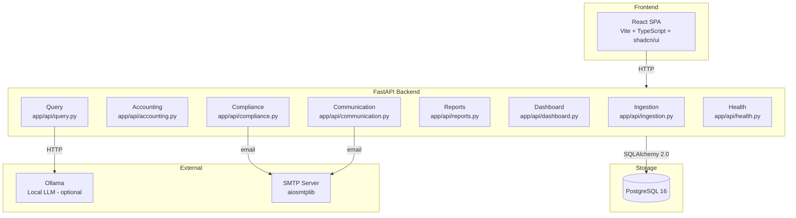
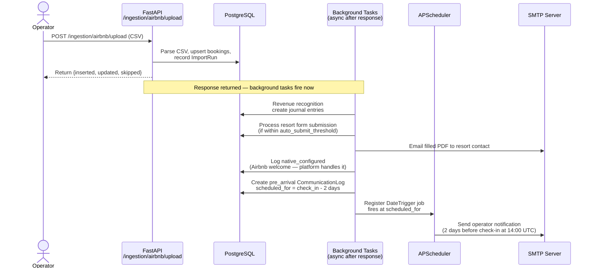
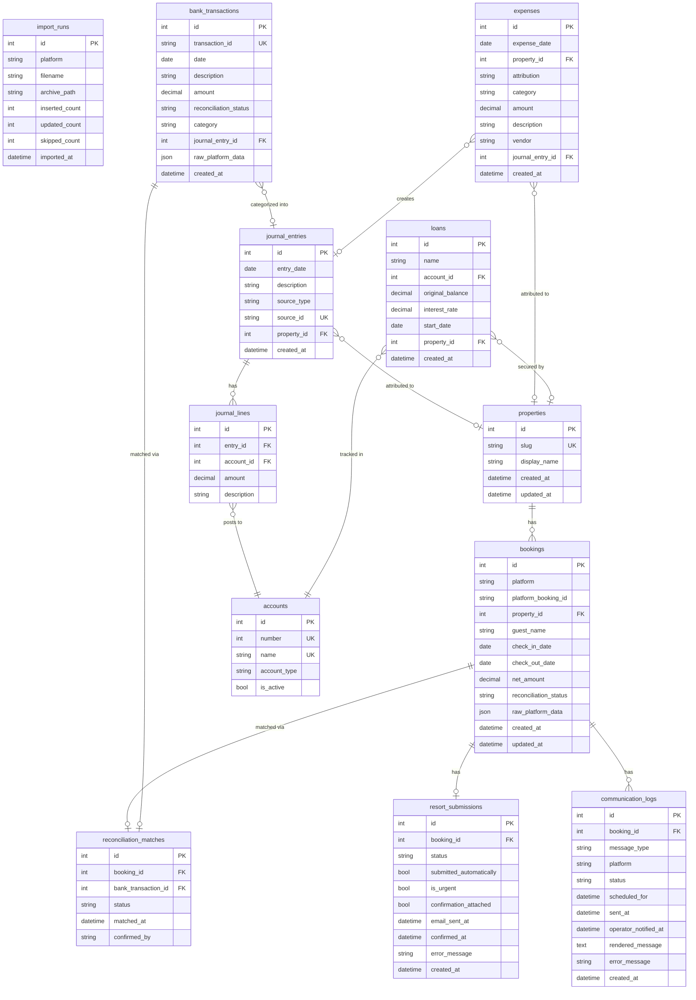
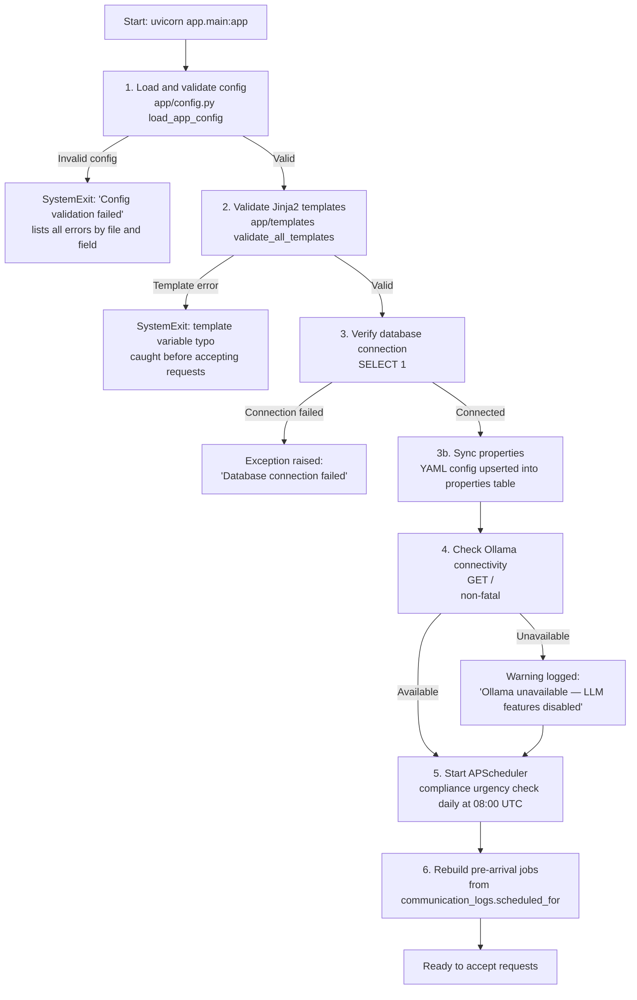

# Architecture Overview

Roost is a self-hosted vacation rental operations platform built on FastAPI, PostgreSQL, and React. It automates the end-to-end lifecycle of a vacation rental booking — from CSV ingestion through accounting, compliance form submission, and guest communication — all without manual intervention after initial configuration.

The system is designed to be config-driven and self-contained. Every property is defined in a YAML file; every booking from every platform flows through a unified normalizer into a single PostgreSQL database. Background tasks handle downstream automation asynchronously so that the operator experiences a fast, synchronous import response while revenue recognition, resort form submission, and guest messaging happen transparently in the background.

This document describes the major subsystems, the end-to-end automation pipeline that ties them together, the data model, the startup sequence, and the key design decisions with their rationale.

---

## System Components

The diagram below shows the major runtime components and their relationships.

### Ingestion (`app/ingestion/`)

Handles CSV parsing and normalization across multiple platforms. Adapters are platform-specific Polars-based parsers for Airbnb Transaction History exports, VRBO Payments Report exports, and Mercury bank statement exports. RVshare bookings are entered manually via a JSON endpoint because RVshare does not provide a compatible CSV export format.

Ingestion is idempotent by design — each booking is identified by a composite unique constraint on `(platform, platform_booking_id)`. Re-importing the same CSV is safe and produces zero duplicate bookings. Bank transactions use a `transaction_id` unique key from the Mercury export for the same guarantee.

Each upload endpoint (`POST /ingestion/airbnb/upload`, `POST /ingestion/vrbo/upload`, `POST /ingestion/mercury/upload`) validates the file extension, delegates to the normalizer, archives the raw CSV, records an `ImportRun`, and then registers FastAPI `BackgroundTask` callbacks for downstream automation. The response is returned immediately with insertion counts; background tasks run after the response.

### Accounting (`app/accounting/`)

Implements double-entry bookkeeping using a chart of accounts seeded during Alembic migration 003. Every financial event creates a balanced journal entry (debit lines and credit lines sum to zero). Key account ranges:

- 1xxx: Assets (Mercury Checking 1010, Accounts Receivable 1020)
- 2xxx: Liabilities (Unearned Revenue 2010, loan payable accounts seeded dynamically)
- 4xxx: Revenue (Rental Income 4000, Promotional Discounts 4010)
- 5xxx: Expenses (Platform Fees 5010, plus operator-defined categories)

Revenue recognition fires automatically as a background task on CSV import and can also be triggered manually via `POST /api/accounting/revenue/recognize-all`. Expense recording, loan payment tracking, and bank reconciliation are operator-triggered. See `app/accounting/revenue.py` for the fee reconstruction logic.

### Compliance (`app/compliance/`)

Fills and emails the resort booking form PDF automatically when a new booking is detected. The PDF form filler (`app/compliance/pdf_filler.py`) uses pypdf (BSD-3-Clause) to write `AcroForm` field values directly onto widget annotations using the `/V` key, then sets `/NeedAppearances=True` so PDF viewers regenerate the visual appearance on open.

A JSON field mapping file (`pdf_mappings/sun_retreats_booking.json`) maps PDF field names to booking data fields or property config fields. The filled PDF is attached to an email and sent to the resort contact.

An `auto_submit_threshold` config parameter (default: 3 days) gates automatic submission. Bookings imported outside the threshold create a `pending` submission record for operator review. When check-in is within the threshold, submission fires automatically as a background task. A daily APScheduler cron job at 08:00 UTC runs an urgency check (`app/compliance/urgency.py`) to flag any pending submissions that are approaching check-in.

### Communication (`app/communication/`)

Generates and tracks guest messages — welcome and pre-arrival — across platforms. The platform determines the delivery mechanism:

**Airbnb welcome:** Airbnb's native scheduled messaging feature handles guest delivery automatically. Roost records the log entry with `status='native_configured'` and does not render or send the message. The platform handles it.

**Airbnb pre-arrival:** Roost renders the message template and emails the operator with copy-pasteable text. The operator sends the message manually via the Airbnb app. Status stays `pending` until the operator confirms via `POST /api/communication/confirm/{log_id}`.

**VRBO / RVshare (both message types):** Roost renders the template and emails the operator with the full message text. Status stays `pending` until the operator confirms manual send on the platform. See `app/communication/messenger.py` for the platform-branching logic.

Pre-arrival messages are scheduled via APScheduler `DateTrigger` jobs. Each job fires 2 days before check-in at 14:00 UTC. On app restart, `rebuild_pre_arrival_jobs()` (`app/communication/scheduler.py`) re-registers all pending future jobs from `communication_logs.scheduled_for`.

### Query (`app/api/query.py`)

A two-phase LLM pipeline that accepts natural language questions and returns SQL query results with a narrative explanation.

**Phase A (non-streaming):** Sends the user's question to Ollama (via `POST /api/query/ask`) with a system prompt that includes the full schema. Temperature is set to 0.1 for deterministic SQL generation. The raw LLM response is parsed for SQL via `extract_sql_from_response()`, then validated using sqlglot (`app/query/sql_validator.py`) to ensure it is a `SELECT` statement. The validated SQL is executed against the database with a 15-second statement timeout.

**Phase B (streaming):** Sends the question, SQL, and query results back to the LLM with a narrative generation prompt at temperature 0.3. The response streams as Server-Sent Events (`event: token`) to the frontend. All numerical claims in the narrative come from SQL results, not from LLM inference.

If Ollama is unavailable, the pipeline returns an error event. If the LLM produces a clarification question instead of SQL, the clarification text is streamed directly to the user without executing a query.

### Dashboard (`app/api/dashboard.py`)

Serves aggregated metrics, booking calendar data, per-property occupancy rates, and a pending action items list. The action items feed a badge count in the UI showing unsubmitted resort forms, unsent guest messages, and unreconciled bank transactions requiring attention.

### Reports (`app/api/reports.py`)

Generates P&L, balance sheet, and income statement from journal entries. All reports support flexible period parameters: `ytd` (year-to-date), `year`, `quarter` (Q1–Q4), `month`, or explicit date ranges.

---

## The Automation Pipeline

This is the core differentiator: a single CSV upload triggers a cascade of downstream automation that runs asynchronously after the response is returned.

**Step-by-step walkthrough:**

1. **CSV upload (synchronous):** The operator uploads an Airbnb Transaction History CSV via `POST /ingestion/airbnb/upload`. The normalizer parses each row using Polars, groups rows by confirmation code, upserts bookings into the `bookings` table, archives the raw file, and records an `ImportRun`. The API returns immediately with counts of inserted, updated, and skipped records. This entire step is synchronous — the response contains no information about downstream processing.

2. **Revenue recognition (background):** After the response is sent, `_fire_background_revenue_recognition()` runs as a `FastAPI BackgroundTask`. For each newly inserted booking, `recognize_booking_revenue()` in `app/accounting/revenue.py` creates balanced journal entries. For Airbnb, the gross revenue is reconstructed from the net payout using the configured fee rate (default: 3% split-fee model): `gross = net / (1 - fee_rate)`. Three debit/credit lines are created: debit Mercury Checking, credit Rental Income (gross), debit Platform Fees. For VRBO/RVshare, the net amount is treated as gross (no per-booking fee data in CSV exports). Recognition is idempotent: the `source_id` field on `journal_entries` is a unique key, so duplicate calls are safe.

3. **Resort form submission (background):** `_fire_background_submissions()` runs as another background task. For each new booking, `process_booking_submission()` in `app/compliance/submission.py` checks whether check-in is within the `auto_submit_threshold` (default: 3 days). If yes, it fills the resort booking form PDF and emails it to the resort contact. If no, it creates a `pending` submission record for operator review. The daily urgency check cron job flags any pending submissions approaching check-in.

4. **Welcome message (background, platform-aware):** For Airbnb bookings, the normalizer logs `native_configured` — Airbnb's native messaging feature handles guest delivery and no further action is taken. For VRBO/RVshare bookings, `_fire_background_welcome_messages()` runs as a background task: it renders the welcome template, emails the operator with the full message text, and creates a `pending` communication log entry awaiting operator confirmation.

5. **Pre-arrival scheduling (background then scheduled):** During ingestion, a `CommunicationLog` entry is created with `message_type='pre_arrival'` and `scheduled_for` set to 2 days before check-in at 14:00 UTC. An APScheduler `DateTrigger` job is registered to fire at that time. On the scheduled date, `send_pre_arrival_message()` renders the pre-arrival template and emails the operator. For all platforms, the operator receives the rendered message text and manually sends it through the appropriate channel; status becomes `sent` when the operator confirms via `POST /api/communication/confirm/{log_id}`.

---

## Data Model

The entity-relationship diagram below covers all 12 database tables.

**Key relationships:**

- `properties` anchors all per-property data. `bookings.property_id`, `journal_entries.property_id`, `expenses.property_id`, and `loans.property_id` all reference it.
- `bookings` is the central operational table. Resort submissions and communication logs are 1-to-1 and 1-to-many off bookings, respectively.
- `journal_entries` → `journal_lines` → `accounts` forms the accounting ledger. Every financial event inserts a `JournalEntry` with two or more `JournalLine` rows. Line amounts are signed: positive = debit, negative = credit.
- `reconciliation_matches` links `bookings` to `bank_transactions`. One match record per booking (unique constraint), one per bank transaction.
- `import_runs` is standalone — it records metadata for each CSV import but has no foreign keys to other tables.

---

## Startup Sequence

The application uses a FastAPI `lifespan` context manager for startup and shutdown. Startup is fail-fast: if any critical resource is unavailable, the application exits with a clear error message before accepting requests.

**Startup philosophy:** Fail early with a specific error message rather than fail late with a confusing runtime error. If `config/jay.yaml` is missing `lock_code`, the error at startup reads `jay.yaml: lock_code: Field required`. If the database is unreachable, the container stops immediately with a clear error rather than accepting requests that will all fail. This design was chosen because debugging a misconfigured self-hosted instance is much easier when the error surfaces at startup.

**Step details:**

1. **Config validation (fail-fast):** `load_app_config()` loads `config/base.yaml` plus all per-property YAML files in `config/`. Each property YAML is parsed as a `PropertyConfig` Pydantic model. All validation errors are collected and raised together as a single `SystemExit` so the operator can fix all problems in one pass.

2. **Template validation (fail-fast):** `validate_all_templates()` renders each Jinja2 message template (welcome, pre-arrival) with dummy data for each property. This catches undefined variable references — for example, a template referencing `{{ custom.pool_code }}` when no property has a `pool_code` in `custom` — before the app accepts any requests.

3. **Database connection (fail-fast):** A `SELECT 1` verifies connectivity. The expectation is that Alembic migrations have been run before startup (the `docker-compose.yml` command runs `alembic upgrade head` before launching uvicorn).

3b. **Property sync:** Properties defined in config YAML are upserted into the `properties` table. New slugs are inserted; existing slugs have `display_name` updated if the config changed.

4. **Ollama check (non-fatal):** Sends a `GET /` to the Ollama URL (default: `http://host.docker.internal:11434`). If unavailable, logs a warning and continues. All LLM query features return an error response if Ollama is down, but the rest of the application functions normally.

5. **APScheduler start:** Registers the compliance urgency cron job (daily at 08:00 UTC) and starts the scheduler.

6. **Pre-arrival job rebuild:** APScheduler uses in-memory job storage. All scheduled jobs are lost on restart. `rebuild_pre_arrival_jobs()` queries `communication_logs` for `pre_arrival` entries with `status='pending'` and `scheduled_for` in the future, then re-registers each as a `DateTrigger` job.

---

## Key Design Decisions

| Decision | What | Why |
|----------|------|-----|
| **Fail-fast startup** | Config, templates, and DB connection are validated before the app accepts requests. Invalid state causes `SystemExit`. | Self-hosted instances have no monitoring dashboard. Errors must be surfaced immediately and clearly at startup rather than appearing as cryptic 500 errors at request time. |
| **Idempotent ingestion** | Bookings use `(platform, platform_booking_id)` unique constraint; bank transactions use `transaction_id`. Re-importing the same CSV produces zero duplicates. | Operators frequently re-export CSVs to catch updates. Making re-import safe eliminates a whole class of user error and allows the system to be used as a sync mechanism. |
| **Background task pattern** | Resort form submission, revenue recognition, and guest message preparation fire as FastAPI `BackgroundTasks` after the HTTP response is returned. | CSV imports can contain hundreds of bookings. Inline processing would result in request timeouts. Background tasks give the operator a fast response while automation runs asynchronously. Errors in background tasks are logged but never affect the import result. |
| **Double-entry accounting** | Every financial event creates balanced `JournalEntry` + `JournalLine` records. All numbers flow through the ledger. | Double-entry provides an audit trail, catches data integrity errors (unbalanced entries fail validation), and enables accurate P&L and balance sheet generation. It also aligns with Schedule E tax reporting. |
| **Text-to-SQL, not LLM arithmetic** | The LLM generates SQL (Phase A), which is executed against PostgreSQL. The LLM then narrates the results (Phase B). Numbers never come from LLM inference. | LLMs hallucinate numeric calculations. SQL executed by a database is deterministic and accurate. This design gets the benefits of natural language understanding (query intent parsing) while keeping numerical accuracy in the database engine. |
| **Config-driven architecture** | Every property is a YAML file; no property data is hardcoded. Multiple properties work with zero code changes. | Open source readiness: any operator can configure Roost for their properties by editing YAML files. No forks, no code edits required. The `listing_slug_map` in each property config maps platform-specific listing identifiers to property slugs. |
| **Preview mode for compliance** | When `auto_submit_threshold` days have not yet been reached, resort form submissions queue as `pending`. Operator reviews and approves via `POST /api/compliance/approve/{id}`. | Resort booking forms are legal documents submitted to a resort on behalf of guests. Automatic submission of an incorrectly filled form is worse than a delayed submission. Preview mode puts a human gate on the process for new properties or before the operator trusts the configuration. |
| **Platform-aware messaging** | Airbnb welcome: `native_configured` (platform delivers). Airbnb pre-arrival + VRBO/RVshare all messages: operator notification email with rendered text, operator sends manually and confirms. | Airbnb has a native automated messaging feature that operators configure on the platform. Duplicating that with a second message sent by Roost would confuse guests. VRBO and RVshare do not have equivalent native automation, so Roost assists by generating the message and notifying the operator. |
| **pypdf for PDF form filling** | PDF AcroForm fields are filled by setting `/V` directly on widget annotations and `/NeedAppearances=True` on the AcroForm dictionary. | pypdf is BSD-3-Clause licensed (Apache 2.0 compatible). The previous library (pymupdf) was AGPL-3.0, which would have forced any distribution to also be AGPL. The direct annotation approach was required due to a bug in pypdf 6.7.5 with WinAnsiEncoding fonts that caused `update_page_form_field_values()` to corrupt text. |

---

## Tech Stack

| Layer | Technology | Version | Notes |
|-------|-----------|---------|-------|
| Backend language | Python | 3.12 | |
| Web framework | FastAPI | 0.115+ | ASGI, async, auto-generates OpenAPI |
| ORM | SQLAlchemy | 2.0 | Core + ORM, typed mapped columns |
| Migrations | Alembic | — | Runs before uvicorn in Docker |
| Config | Pydantic Settings | — | YAML + .env + env var precedence |
| Database | PostgreSQL | 16 | `postgres:16-alpine` image |
| Frontend | React + TypeScript | — | Vite build, shadcn/ui components |
| LLM | Ollama | local | Optional; default model: `llama3.2:latest` |
| Email | aiosmtplib | — | Async SMTP with tenacity retries |
| PDF | pypdf | 6.7.5+ | BSD-3-Clause; AcroForm filling |
| Scheduling | APScheduler | — | In-memory store; jobs rebuilt on restart |
| CSV parsing | Polars | — | Platform-specific adapters |
| Logging | structlog | — | Structured JSON logging |
| Container | Docker + Compose | — | Two services: `roost-api`, `roost-db` |
| Package manager | uv | — | Fast resolver, `uv.lock` for reproducibility |
| License | Apache 2.0 | — | |

**Docker services:** `roost-db` runs `postgres:16-alpine` with a `db_data` volume. `roost-api` builds the application container, runs `alembic upgrade head` then uvicorn on port 8000. Config, templates, PDF mappings, and archive directories are mounted as volumes so operator-controlled files live outside the container. See `docker-compose.yml` for the full configuration.

**Full API specification:** When running, the auto-generated OpenAPI documentation is available at `http://localhost:8000/docs` (Swagger UI) and `http://localhost:8000/redoc` (ReDoc). These are always current because FastAPI generates them from the type annotations and docstrings in `app/api/`.
